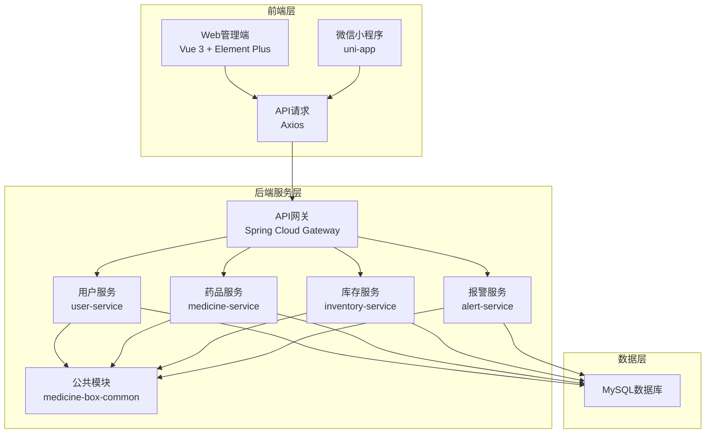
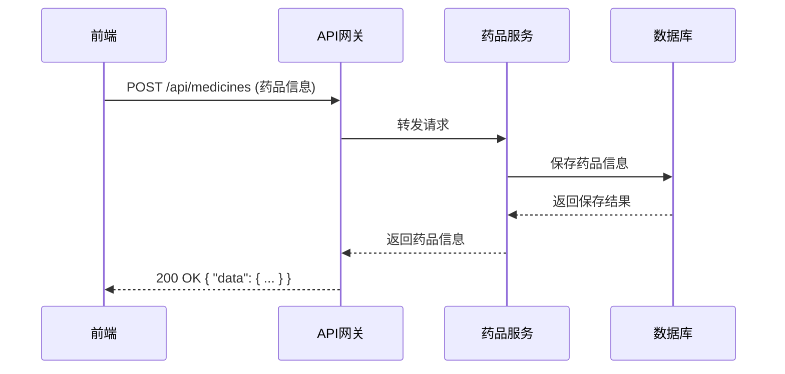
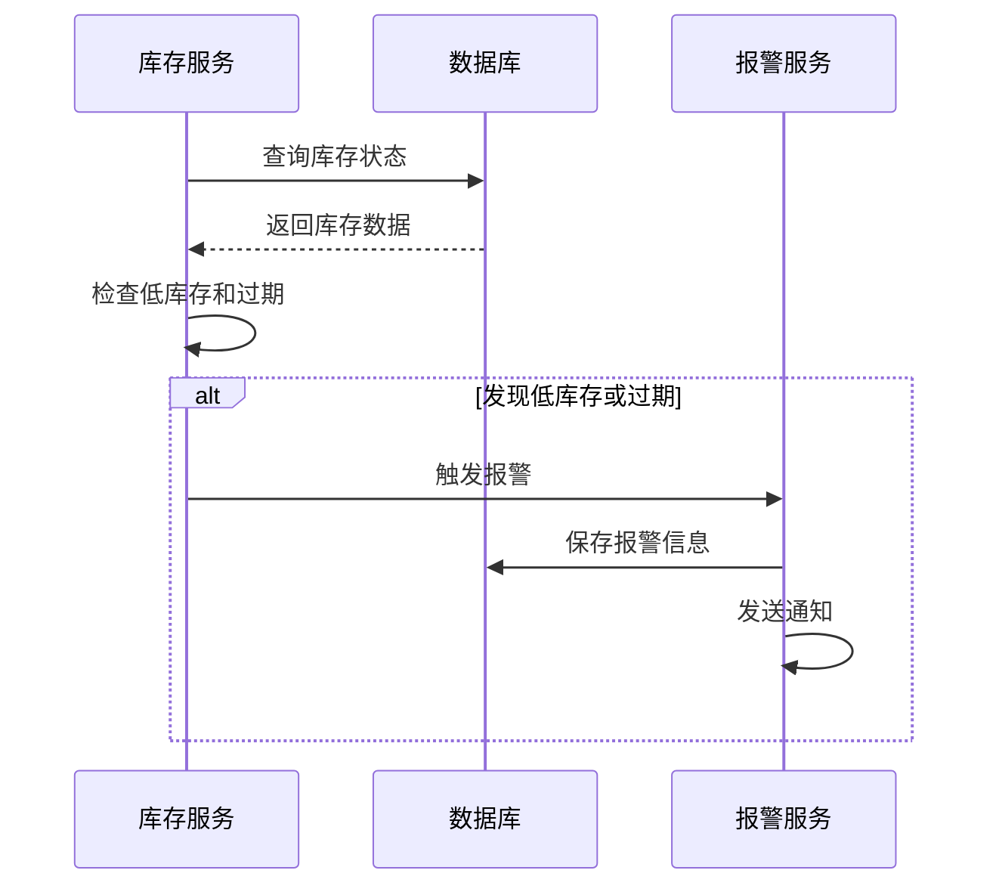

# 家庭药箱管理系统 - 技术架构文档

## 1. 系统概述

家庭药箱管理系统是一个集Web管理端和微信小程序于一体的智能健康管理解决方案，旨在解决家庭药品管理的痛点问题。系统采用前后端分离架构，后端使用Spring Boot微服务，前端使用Vue 3，微信小程序使用uni-app框架。

## 2. 技术架构

### 2.1 整体架构

系统采用典型的三层架构：

1. **前端层**：包括Web管理端和微信小程序
2. **后端服务层**：Spring Boot微服务集群
3. **数据层**：MySQL数据库

### 2.2 架构图

## 3. 技术栈详情

### 3.1 前端技术栈

| 技术 | 版本 | 用途 |
|------|------|------|
| Vue 3 | 3.5.29 | 前端框架 |
| Vite | 7.3.1 | 构建工具 |
| Element Plus | 2.13.3 | UI组件库 |
| Pinia | 3.0.4 | 状态管理 |
| TypeScript | 5.9.3 | 类型系统 |
| Axios | 1.13.6 | HTTP客户端 |
| ECharts | 6.0.0 | 图表库 |
| Less | 4.5.1 | CSS预处理器 |
| uni-app | 2.0.2 | 小程序框架 |
| uni-ui | 1.5.11 | 小程序UI组件库 |

### 3.2 后端技术栈

| 技术 | 版本 | 用途 |
|------|------|------|
| Spring Boot | 2.7.15 | 后端框架 |
| Spring Cloud | 2021.0.8 | 微服务架构 |
| MySQL | 8+ | 数据库 |
| MyBatis-Plus | 3.5.3 | ORM框架 |
| Spring Security | 5.7.10 | 安全框架 |
| Swagger | 3.0.0 | API文档 |
| JDK | 1.8 | 开发环境 |
| Maven | 3.6.0+ | 构建工具 |

## 4. 核心组件设计

### 4.1 前端组件

#### Web管理端

| 组件 | 功能 | 路径 |
|------|------|------|
| Home.vue | 首页仪表盘 | frontend/src/views/Home.vue |
| Medicine.vue | 药品管理 | frontend/src/views/Medicine.vue |
| Inventory.vue | 库存管理 | frontend/src/views/Inventory.vue |
| Alert.vue | 报警管理 | frontend/src/views/Alert.vue |

#### 微信小程序

| 组件 | 功能 | 路径 |
|------|------|------|
| home.vue | 首页 | miniprogram/src/pages/home.vue |
| medicine.vue | 药品管理 | miniprogram/src/pages/medicine.vue |
| inventory.vue | 库存管理 | miniprogram/src/pages/inventory.vue |
| mine.vue | 个人中心 | miniprogram/src/pages/mine.vue |

### 4.2 后端服务

| 服务 | 功能 | 路径 |
|------|------|------|
| user-service | 用户管理 | backend/medicine-box-biz/user-service |
| medicine-service | 药品管理 | backend/medicine-box-biz/medicine-service |
| inventory-service | 库存管理 | backend/medicine-box-biz/inventory-service |
| alert-service | 报警管理 | backend/medicine-box-biz/alert-service |
| medicine-box-gateway | API网关 | backend/medicine-box-gateway |
| medicine-box-common | 公共模块 | backend/medicine-box-common |

### 4.3 数据模型

| 模型 | 功能 | 路径 |
|------|------|------|
| BaseModel | 基础模型 | backend/medicine-box-common/src/main/java/com/medicinebox/common/model/BaseModel.java |
| User | 用户模型 | backend/medicine-box-common/src/main/java/com/medicinebox/common/model/User.java |
| Medicine | 药品模型 | backend/medicine-box-common/src/main/java/com/medicinebox/common/model/Medicine.java |
| Inventory | 库存模型 | backend/medicine-box-common/src/main/java/com/medicinebox/common/model/Inventory.java |

## 5. 数据库设计

### 5.1 数据库表结构

#### users表
| 字段名 | 数据类型 | 描述 |
|--------|----------|------|
| id | VARCHAR(36) | 主键UUID |
| username | VARCHAR(50) | 用户名 |
| password | VARCHAR(100) | 密码 |
| phone | VARCHAR(20) | 手机号 |
| email | VARCHAR(100) | 邮箱 |
| nickname | VARCHAR(50) | 昵称 |
| avatar | VARCHAR(255) | 头像 |
| gender | TINYINT | 性别 |
| birthdate | DATE | 出生日期 |
| role | TINYINT | 角色 |
| status | TINYINT | 状态 |
| last_login_time | DATETIME | 最后登录时间 |
| create_time | DATETIME | 创建时间 |
| update_time | DATETIME | 更新时间 |
| deleted | TINYINT | 逻辑删除 |

#### medicines表
| 字段名 | 数据类型 | 描述 |
|--------|----------|------|
| id | VARCHAR(36) | 主键UUID |
| name | VARCHAR(100) | 药品名称 |
| category_id | VARCHAR(36) | 分类ID |
| brand | VARCHAR(100) | 品牌 |
| specification | VARCHAR(100) | 规格 |
| dosage_form | VARCHAR(50) | 剂型 |
| usage | TEXT | 用法用量 |
| indications | TEXT | 适应症 |
| contraindications | TEXT | 禁忌症 |
| side_effects | TEXT | 不良反应 |
| storage_condition | VARCHAR(255) | 储存条件 |
| expiry_date_days | INT | 保质期(天) |
| manufacturer | VARCHAR(100) | 生产厂家 |
| approval_number | VARCHAR(50) | 批准文号 |
| price | DECIMAL(10,2) | 价格 |
| barcode | VARCHAR(50) | 条形码 |
| status | TINYINT | 状态 |
| create_time | DATETIME | 创建时间 |
| update_time | DATETIME | 更新时间 |
| deleted | TINYINT | 逻辑删除 |

#### inventory表
| 字段名 | 数据类型 | 描述 |
|--------|----------|------|
| id | VARCHAR(36) | 主键UUID |
| user_id | VARCHAR(36) | 用户ID |
| medicine_id | VARCHAR(36) | 药品ID |
| batch_number | VARCHAR(50) | 批次号 |
| purchase_date | DATE | 购买日期 |
| expiry_date | DATE | 过期日期 |
| current_quantity | INT | 当前数量 |
| min_stock | INT | 最低库存 |
| unit | VARCHAR(20) | 单位 |
| location | VARCHAR(100) | 存放位置 |
| last_update_time | DATETIME | 最后更新时间 |
| deleted | TINYINT | 逻辑删除 |

#### alerts表
| 字段名 | 数据类型 | 描述 |
|--------|----------|------|
| id | VARCHAR(36) | 主键UUID |
| user_id | VARCHAR(36) | 用户ID |
| medicine_id | VARCHAR(36) | 药品ID |
| alert_type | TINYINT | 报警类型 |
| alert_level | TINYINT | 报警级别 |
| message | VARCHAR(255) | 报警消息 |
| status | TINYINT | 状态 |
| send_time | DATETIME | 发送时间 |
| resolve_time | DATETIME | 解决时间 |
| create_time | DATETIME | 创建时间 |

## 6. API接口设计

### 6.1 用户服务API

| 接口 | 方法 | 路径 | 功能 |
|------|------|------|------|
| 创建用户 | POST | /api/users | 创建新用户 |
| 获取用户 | GET | /api/users/{id} | 根据ID获取用户 |
| 更新用户 | PUT | /api/users | 更新用户信息 |
| 删除用户 | DELETE | /api/users/{id} | 删除用户(逻辑删除) |
| 获取所有用户 | GET | /api/users | 获取所有用户 |
| 用户登录 | POST | /api/users/login | 用户登录 |

### 6.2 药品服务API

| 接口 | 方法 | 路径 | 功能 |
|------|------|------|------|
| 创建药品 | POST | /api/medicines | 创建新药品 |
| 获取药品 | GET | /api/medicines/{id} | 根据ID获取药品 |
| 更新药品 | PUT | /api/medicines | 更新药品信息 |
| 删除药品 | DELETE | /api/medicines/{id} | 删除药品(逻辑删除) |
| 获取所有药品 | GET | /api/medicines | 获取所有药品 |
| 按分类获取药品 | GET | /api/medicines/category/{categoryId} | 根据分类ID获取药品 |

### 6.3 库存服务API

| 接口 | 方法 | 路径 | 功能 |
|------|------|------|------|
| 创建库存 | POST | /api/inventory | 创建新库存 |
| 获取库存 | GET | /api/inventory/{id} | 根据ID获取库存 |
| 更新库存 | PUT | /api/inventory | 更新库存信息 |
| 删除库存 | DELETE | /api/inventory/{id} | 删除库存(逻辑删除) |
| 获取用户库存 | GET | /api/inventory/user/{userId} | 获取用户的所有库存 |
| 获取低库存 | GET | /api/inventory/low-stock | 获取低库存药品 |
| 获取过期药品 | GET | /api/inventory/expired | 获取过期药品 |

### 6.4 报警服务API

| 接口 | 方法 | 路径 | 功能 |
|------|------|------|------|
| 创建报警 | POST | /api/alerts | 创建新报警 |
| 获取报警 | GET | /api/alerts/{id} | 根据ID获取报警 |
| 更新报警 | PUT | /api/alerts | 更新报警信息 |
| 获取用户报警 | GET | /api/alerts/user/{userId} | 获取用户的所有报警 |
| 获取未处理报警 | GET | /api/alerts/unresolved | 获取未处理的报警 |
| 创建报警设置 | POST | /api/alerts/settings | 创建报警设置 |
| 获取报警设置 | GET | /api/alerts/settings/{userId} | 获取用户的报警设置 |

## 7. 数据流设计

### 7.1 药品管理流程

### 7.2 库存监控流程

## 8. 部署架构

### 8.1 开发环境

- **前端**: 本地开发服务器 (http://localhost:5173)
- **小程序**: HBuilderX 模拟器
- **后端**: 本地Spring Boot服务 (http://localhost:8080)
- **数据库**: 本地MySQL (localhost:3306)

### 8.2 生产环境

- **前端**: 部署到Nginx或CDN
- **小程序**: 发布到微信小程序平台
- **后端**: 部署到云服务器或容器平台
- **数据库**: 部署到云数据库服务

## 9. 安全设计

### 9.1 前端安全

- 使用HTTPS协议
- 输入验证和过滤
- 防止XSS攻击
- 防止CSRF攻击
- 敏感信息加密存储

### 9.2 后端安全

- Spring Security认证授权
- API接口权限控制
- 密码加密存储
- SQL注入防护
- 日志审计
- 限流和防DDoS攻击

## 10. 性能优化

### 10.1 前端优化

- 代码分割和懒加载
- 资源压缩和缓存
- 图片优化
- 减少HTTP请求
- 使用CDN加速

### 10.2 后端优化

- 数据库索引优化
- 缓存机制
- 连接池配置
- 异步处理
- 微服务负载均衡

## 11. 监控和日志

### 11.1 监控

- 系统运行状态监控
- API接口调用监控
- 数据库性能监控
- 报警触发监控

### 11.2 日志

- 系统日志
- 业务日志
- 错误日志
- 访问日志

## 12. 未来扩展

### 12.1 技术扩展

- AI智能识别药品
- 语音助手
- 健康数据集成
- 区块链药品溯源
- 云服务部署

### 12.2 功能扩展

- 药品推荐系统
- 用药提醒
- 药品共享
- 健康知识库
- 社区互动
- 紧急求助
- 多语言支持

## 13. 总结

家庭药箱管理系统采用现代化的技术架构，实现了药品管理、库存监控、报警提醒等核心功能。系统具有良好的可扩展性和可维护性，为家庭用户提供了便捷的药品管理工具，帮助用户解决药品管理的痛点问题。

通过持续的技术创新和功能扩展，系统将不断提升用户体验，成为家庭健康管理的重要工具。
